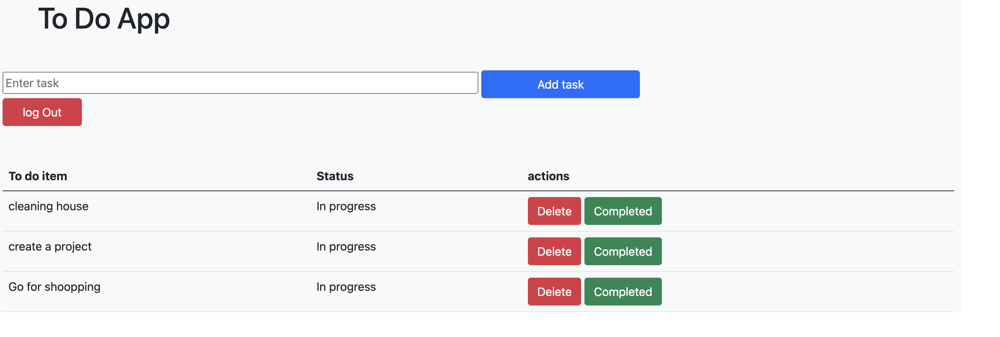
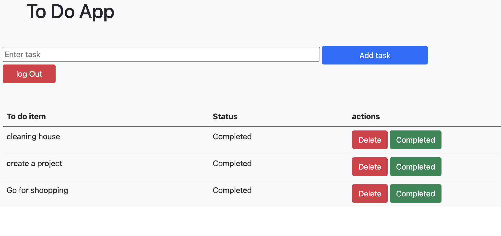
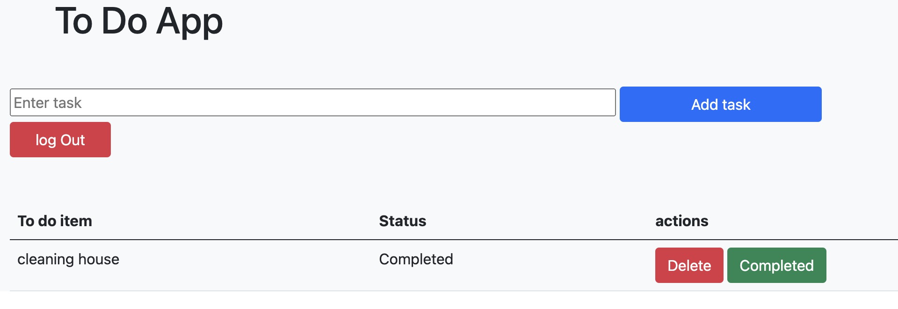

# To Do App Django
This is a To-Do app build using django framework of python. Here user can create his/her todo task by adding items, mark task  as complete or delete task.

## Technologies Used :

 1. Python
 2. Django
 3. Bootstrap

## Running the project
   * cd toDoProject
   * python3 manage.py runserver

## Features
 ###  Adding task
   

### mark completed
  

### Delete task
  

   
